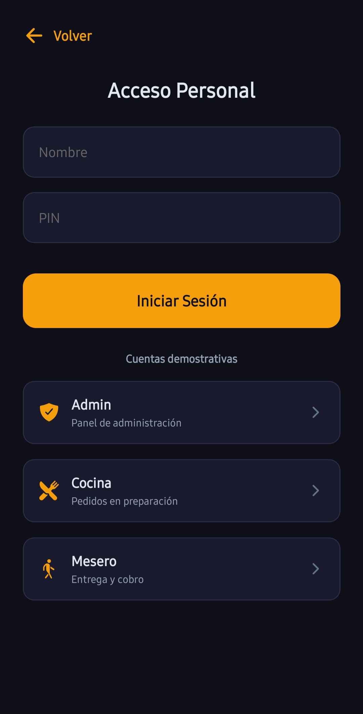
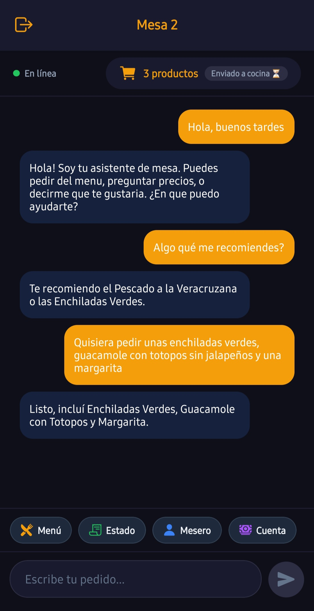
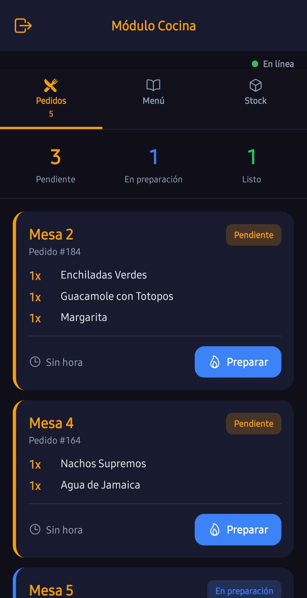
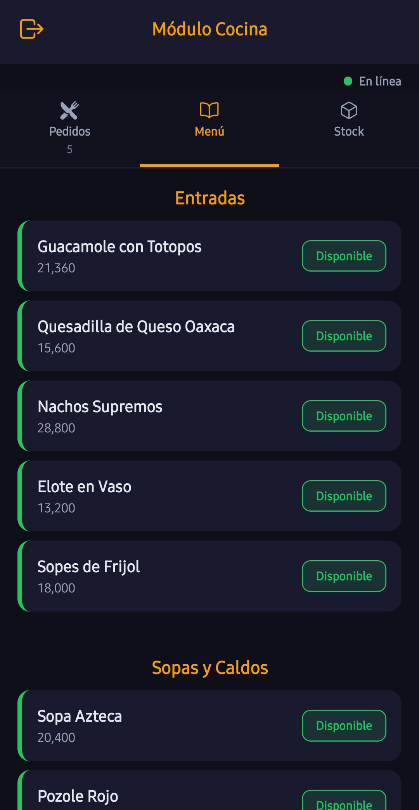
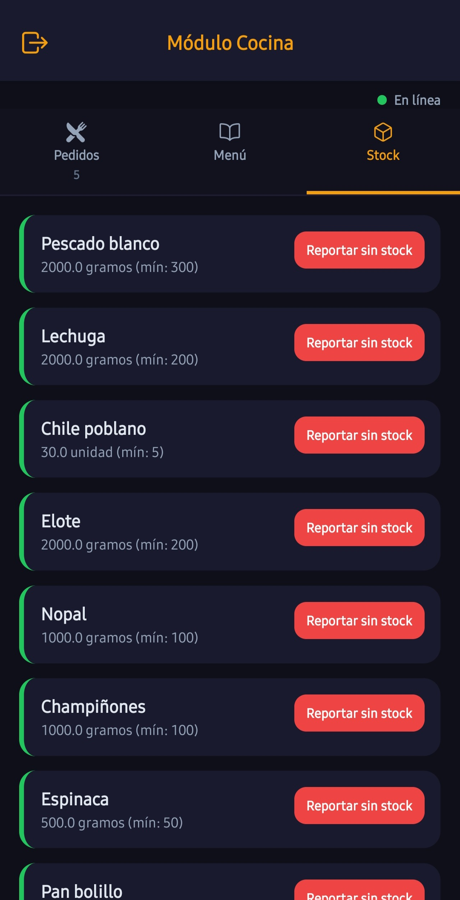
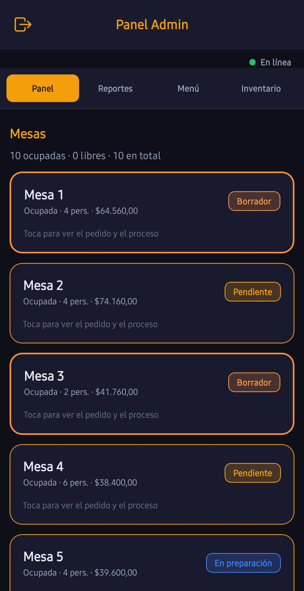
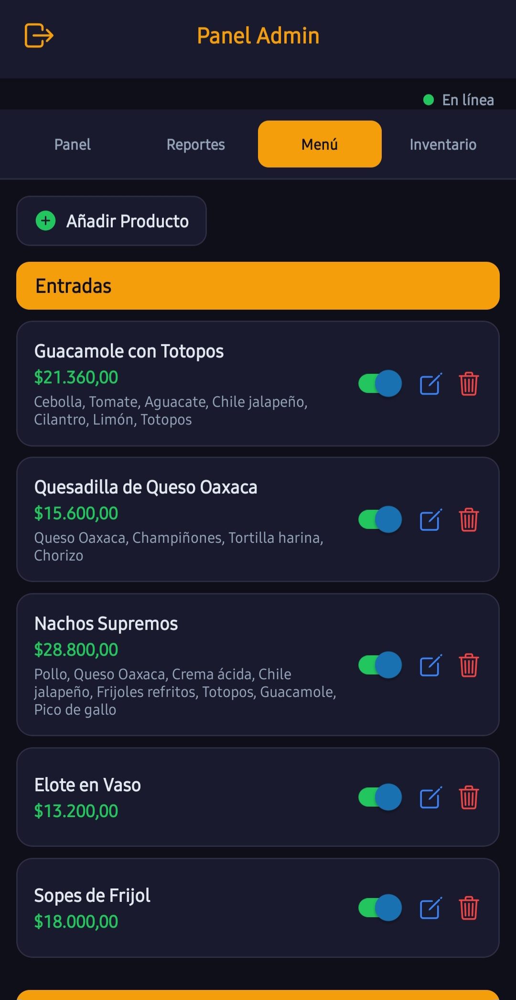
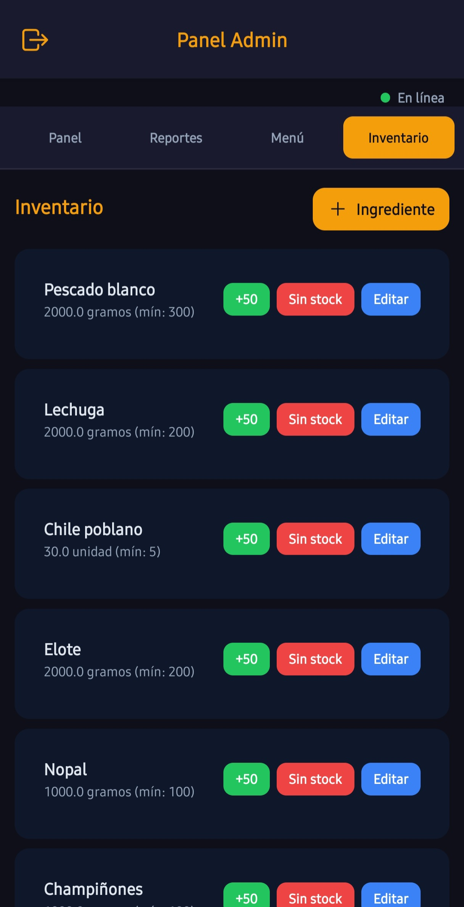
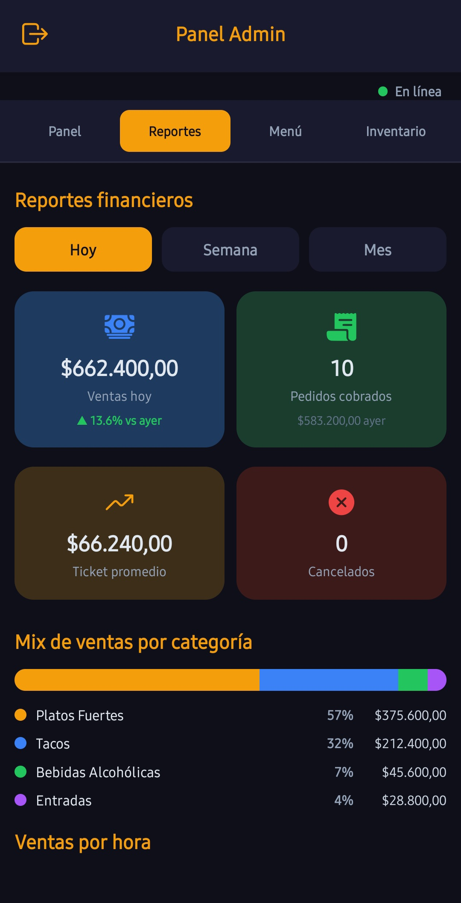

# **Atempo — Plataforma Inteligente de Gestión para Restaurantes**

Una aplicación full stack de gestión para restaurantes que cuenta con un cliente móvil, paneles para el personal, actualizaciones de pedidos en tiempo real, seguimiento de inventario y un flujo de pedidos asistido por IA para los clientes en mesa.

## Demo

<br>

<p align="center">
  
</p>

<p align="center">
  <em>Plataforma integral de restaurantes con pedidos en tiempo real y asistencia inteligente mediante IA.</em>
</p>

## Descripción general

Atempo es una aplicación full stack diseñada para gestionar el flujo de pedidos en un restaurante, desde la mesa del cliente hasta las áreas de cocina, meseros y administración.

El proyecto busca resolver la necesidad de centralizar en un solo sistema la gestión de pedidos, la disponibilidad del menú, el control de inventario, las acciones del personal y la comunicación con los clientes. Los clientes pueden interactuar con un asistente de chat, consultar el menú, agregar productos a un pedido, solicitar atención de un mesero y pedir la cuenta. Por su parte, el personal del restaurante puede gestionar pedidos de cocina, alertas para meseros, pagos, inventario, reportes y la información del catálogo.

## Características

- Chat con IA para pedir, modificar y pedir la cuenta
- Menú con precios y disponibilidad
- Pedido con estados (borrador → cocina → entregado → cobro)
- Paneles de cocina, mesero y administración
- Inventario que se valida y descuenta al confirmar
- Tiempo real con WebSockets
- JWT y roles (admin, cocina, mesero)
- Reportes de ventas (CSV / PDF)

## Screenshots


### Cliente

| Inicio de sesión | Chat y menú |
| :---: | :---: |
| <p align="center"></p> | <p align="center"></p> |

### Cocina

| Pedidos | Menú | Stock |
| :---: | :---: | :---: |
| <p align="center"></p> | <p align="center"></p> | <p align="center"></p> |

### Administración

| Panel | Menú | Inventario | Reportes |
| :---: | :---: | :---: | :---: |
| <p align="center"></p> | <p align="center"></p> | <p align="center"></p> | <p align="center"></p> |

<p align="center">
  <em>Capturas de las pantallas principales. Las imágenes están en <a href="./assets/">assets/</a>.</em>
</p>

## Tecnologías utilizadas

- **App:** Expo · React Native · React Navigation
- **API:** Java 21 · Spring Boot · Spring Security · JPA · Flyway
- **Datos:** PostgreSQL · pgvector
- **Tiempo real:** WebSocket / STOMP
- **IA:** Ollama (LLM local)
- **Extra:** Docker Compose · OpenPDF · Swagger

## Requisitos e instalación

## Requisitos

* Java 21, Node.js 18 o superior y npm
* Docker Desktop
* Ollama instalado localmente, con los modelos `llama3.2:3b` y `nomic-embed-text`
* Expo Go (compatible con SDK 54) para pruebas en dispositivos móviles

## Instalación rápida

```powershell
# 1. Clonar el repositorio
git clone https://github.com/JulianAyaO/Atempo-app.git
cd Atempo-app

# 2. Levantar la base de datos
cd docker
docker compose up -d
cd ..

# 3. Preparar Ollama (en otra terminal)
ollama pull llama3.2:3b
ollama pull nomic-embed-text
ollama serve

# 4. Ejecutar el backend (en otra terminal)
cd backend
.\run.ps1

# 5. Ejecutar la app móvil (en otra terminal)
cd expo
npm install
$env:EXPO_PUBLIC_SERVER_URL="http://TU_IP:8080"
npx expo start --lan --clear
```

> Para Expo Go, reemplaza `TU_IP` por la dirección IPv4 de tu computador dentro de la misma red local.
> Ejemplo: `192.168.1.10`.

Comprueba el backend en:

```text
http://localhost:8080/api/health
```

## Variables de entorno

Copia el archivo `.env.example` si necesitas personalizar la configuración del entorno. En desarrollo local, los valores por defecto del perfil `dev` suelen ser suficientes.

| Variable                 | Descripción                                                                |
| ------------------------ | -------------------------------------------------------------------------- |
| `DB_*`                   | Configuración de conexión a PostgreSQL                                     |
| `JWT_SECRET`             | Clave utilizada para la generación y validación de tokens JWT del personal |
| `OLLAMA_BASE_URL`        | URL base del servicio local de Ollama                                      |
| `EXPO_PUBLIC_SERVER_URL` | URL del backend consumida por la aplicación móvil                          |

## Despliegue

Actualmente, el proyecto está orientado principalmente a **desarrollo y ejecución en entorno local**. Por el momento no se encuentra disponible una demo pública en la web.

## Estructura del proyecto

```text
proyecto_restaurante/
├── .github/workflows/         # configuración de integración continua (CI)
├── assets/                    # gif de demo y capturas para el README
├── backend/                   # API y lógica del backend con Spring Boot
├── docker/                    # configuración de Docker Compose para PostgreSQL
├── expo/                      # aplicación móvil desarrollada con React Native y Expo
├── scripts/                   # scripts auxiliares del proyecto
├── .env.example               # ejemplo de variables de entorno
└── README.md 
```

## Autor

**Julian Aya Orozco**

[](https://github.com/JulianAyaO)
[](https://www.linkedin.com/in/julian-aya-orozco-338a78431/)
